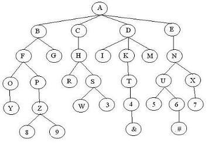
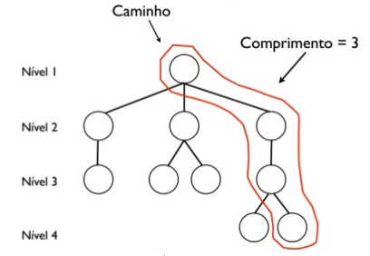
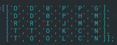

Algoritmo
---------

Estrutura de dados
##################

| A estrutura de dados escolhida para solução do problema é uma árvore genérica.

|

| Cada nó desta árvore corresponde a um estado da matriz que representa o jogo, aonde o nó raíz será o estado inicial da matriz.
| A partir do estado inicial, é possivel enxergar 8 novos candidatos a novos estados. Cada estado representa um nó filho de seu nó pai.
| Recursivamente, temos o mesmo raciocínio para cada nó, até que se chegue no estado desejado que é com a dama em sua saída.
| É de suma importância que uma geração de um novo filho não gere um estado que já se encontre na árvore para que se evite loops eternos ou que 
cheguemos em uma configuração na qual já se tem o caminho.

| O caminho do nó raíz até o nó folha que é o estado final buscado, representa a solução do problema.

| O comprimento do caminho representa a quantidade de passos feitos para chegar na solução.

Modelagem do Klotski
####################

| A modelagem do Jogo foi feita através de uma matriz onde letras representam as peças diferentes e 0 os espaços em branco:

| A letra 'D' representa a **dama** que é a peça que temos como objetivo tirar do quebra cabeça.

