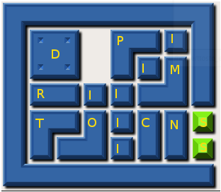

Introdução
==========

| Klotski é um jogo famoso de quebra-cabeça, onde o objetivo é retirar uma peça principal de dentro de um confinamento em meio a obstaculos móveis.

.. image:: images/klotski.png 
	:scale: 70%
	:align: center

|
|

| O jogo tem uma certa complexidade e o desafio proposto por esse trabalho é desenvolver um software capaz de solucionar um caso particular desse jogo.

